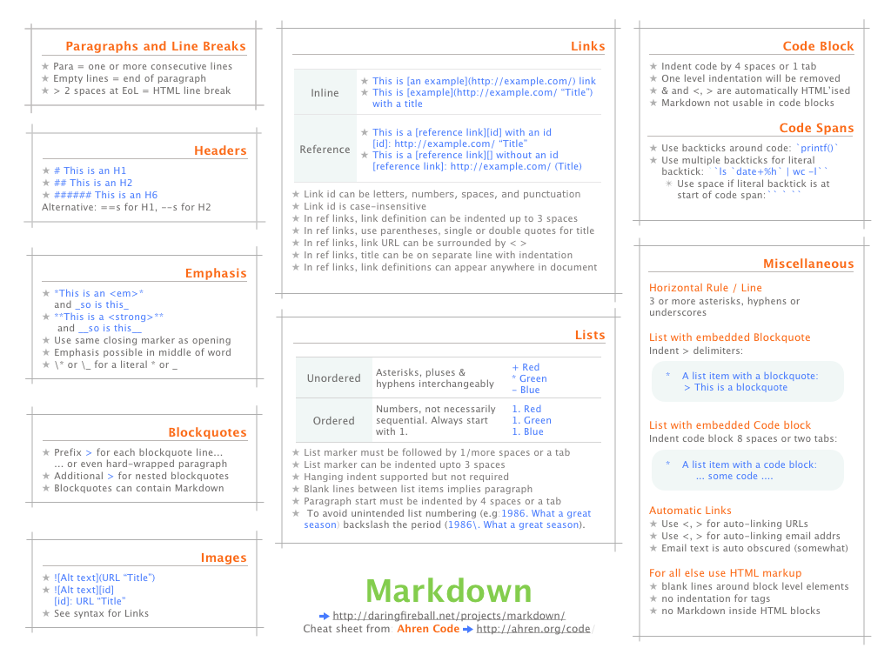

Markdown 语法手册
=================

15 August 2013

Markdown
是一种轻量级标记语言，能将文本换成有效的XHTML(或者HTML)文档，它的目标是实现易读易写，成为一种适用于网络的书写语言。

Markdown
语法简洁明了，易于掌握，所以用它来写作是件既效率又舒服的事情。我们所熟知的和一些大型CMS，如Joomla!、Drupal等都能很好的支持Markdown。我是因为写GitHub项目库中的Readme才开始接触Markdown。

Markdown 不是想要取代
HTML，甚至也没有要和它相近，它的语法种类很少，只对应 HTML
标记的一小部分。Markdown 的构想不是要使得 HTML
文档更容易书写。在我看来， HTML 已经很容易写了。Markdown
的理念是，能让文档更容易读、写和随意改。HTML 是一种发布的格式，Markdown
是一种书写的格式。就这样，Markdown
的格式语法只涵盖纯文本可以涵盖的范围。

**Headers 标题：**

  ------------------------------------------------------------------------
  `#  H1`{.plain .plain}
  `##  H2`{.plain .plain}
  `###  H3`{.plain .plain}
  `####  H4`{.plain .plain}
  `#####  H5`{.plain .plain}
  `######  H6`{.plain .plain}
   
  `另外，H1和H2还能用以下方式显示：`{.plain .plain}
  `一级标题`{.plain .plain}
  `===`{.plain .plain}
   
  `二级标题`{.plain .plain}
  `---`{.plain .plain}
  ------------------------------------------------------------------------

**Emphasis 文本强调：**

  ------------------------------------------------------------------------
  `*斜体* or _强调_`{.plain .plain}
  `**加粗** or __加粗__`{.plain .plain}
  `***粗斜体*** or ___粗斜体__`{.plain .plain}
   
  `但是，如果你的 * 和 _ 两边都有空白的话，它们就只会被当成普通的符号：这是一段* 文本强调 *的说明示例。`{.plain

  .plain}
  `如果要在文字前后直接插入普通的星号或底线，你可以用反斜线（转义符）：\*this text is surrounded by literal 
  asterisks\*`{.plain
  .plain}
  ------------------------------------------------------------------------

**Lists 列表：**

  ------------------------------------------------------------------------
  `Unordered 无序列表：`{.plain .plain} 
  `* 无序列表`{.plain .plain} 
  `* 子项`{.plain .plain} 
  `* 子项`{.plain .plain} 
   
  `+ 无序列表`{.plain .plain} 
  `+ 子项`{.plain .plain} 
  `+ 子项`{.plain .plain} 
   
  `- 无序列表`{.plain .plain} 
  `- 子项`{.plain .plain} 
  `- 子项`{.plain .plain} 
   
  `Ordered 有序列表：`{.plain .plain} 
  `1. 第一行`{.plain .plain} 
  `2. 第二行`{.plain .plain} 
  `3. 第三行`{.plain .plain} 
   
  `1. 第一行`{.plain .plain} 
  `- 第二行`{.plain .plain} 
  `- 第三行`{.plain .plain} 
   
  `组合：`{.plain .plain}
  `* 产品介绍（子项无项目符号）`{.plain .plain}
  `    `{.plain .spaces}`此时子项，要以一个制表符或者4个空格缩进`{.plain
  .plain}
   
  `* 产品特点`{.plain .plain}
  `    `{.plain .spaces}`1. 特点1`{.plain .plain}
  `    `{.plain .spaces}`- 特点2`{.plain .plain}
  `    `{.plain .spaces}`- 特点3`{.plain .plain}
  `* 产品功能`{.plain .plain}
  `    `{.plain .spaces}`1. 功能1`{.plain .plain}
  `    `{.plain .spaces}`- 功能2`{.plain .plain}
  `    `{.plain .spaces}`- 功能3`{.plain .plain}
   
  `可有时我们会出现这样的情况，首行内容是以日期或数字开头：2013. 公司年度目标。`{.plain

  .plain}
  `为了避免也被转化成有序列表，我们可以在"."前加上反斜杠（转义符）：2013\. 公司年度目标。`{.plain

  .plain}
  ------------------------------------------------------------------------

**Links 连接（title为可选项）：**

  ------------------------------------------------------------------------
  `Inline-style 内嵌方式：`{.plain .plain}
  `[link text](https://www.google.com "title text")`{.plain .plain}
   
  `Reference-style 引用方式：`{.plain .plain}
  `[link text][id]`{.plain .plain}
  `[id]: https://www.mozilla.org "title text"`{.plain .plain}
   
  `Relative reference to a repository file 引用存储文件：`{.plain .plain}
  `[link text](../path/file/readme.text "title text")`{.plain .plain}
   
  `还能这样使用：`{.plain .plain}
  `[link text][]`{.plain .plain}
  `[link text]: http://www.reddit.com`{.plain .plain}
   
  `Email 邮件：`{.plain .plain}
  `<example@example.com>`{.plain .plain}
  ------------------------------------------------------------------------

**Images 图片：**

  ------------------------------------------------------------------------
  `Inline-style 内嵌方式：`{.plain .plain}
  ``{.plain
  .plain}
   
  `Reference-style 引用方式：`{.plain .plain}
  `![alt text][logo]`{.plain .plain}
  `[logo]: https://github.com/adam-p/markdown-here/raw/master/src/common/i
  mages/icon48.png "title text"`{.plain
  .plain}
  ------------------------------------------------------------------------

**Code and Syntax Highlighting 代码和语法高亮：**

  ------------------------------------------------------------------------
  `标记一小段行内代码：`{.plain .plain}
  `` 本文是一篇介绍`Markdown`的语法的文章 ``{.plain .plain}
   
  `` 如果高亮的内容包含`号，可以这样写： ``{.plain .plain}
  ``` `` `包裹起来` `` ```{.plain .plain}
   
  `语法高亮：`{.plain .plain}
  ```` ```html ````{.plain .plain}
  `    `{.plain .spaces}`<div>Syntax Highlighting</div>`{.plain .plain}
  ```` ``` ````{.plain .plain}
  ```` ```css ````{.plain .plain}
  `    `{.plain .spaces}`body{font-size:12px}`{.plain .plain}
  ```` ``` ````{.plain .plain}
   
  ```` ```javascript ````{.plain .plain}
  `    `{.plain .spaces}`var s = "JavaScript syntax highlighting";`{.plain
  .plain}
  `    `{.plain .spaces}`alert(s);`{.plain .plain}
  ```` ``` ````{.plain .plain}
  ```` ```php ````{.plain .plain}
  `    `{.plain .spaces}`<?php`{.plain .plain}
  `      `{.plain .spaces}`echo "hello, world!";`{.plain .plain}
  `    `{.plain .spaces}`?>`{.plain .plain}
  ```` ``` ````{.plain .plain}
  ```` ```python ````{.plain .plain}
  `    `{.plain .spaces}`s = "Python syntax highlighting"`{.plain .plain}
  `    `{.plain .spaces}`print s`{.plain .plain}
  ```` ``` ````{.plain .plain}
  ------------------------------------------------------------------------

**Block Code 代码分组(代码区块)：**

  ------------------------------------------------------------------------
  `在该行开头缩进4个空格或一个制表符(tab)`{.plain .plain}
   
  `<strong>Blockquotes 引用：</strong>`{.plain .plain}
  `> Email-style angle brackets`{.plain .plain}
  `> are used for blockquotes.`{.plain .plain}
  `> > And, they can be nested.`{.plain .plain}
  `> #### Headers in blockquotes`{.plain .plain}
  `> * You can quote a list.`{.plain .plain}
  `> * Etc.`{.plain .plain}
  ------------------------------------------------------------------------

**Hard Line Breaks 换行：**

  ------------------------------------------------------------------------
  `在一行的结尾处加上2个或2个以上的空格，也可以使用</br>标签`{.plain
  .plain}
  `第一行文字，`{.plain .plain}
  `第二行文字`{.plain .plain}
  ------------------------------------------------------------------------

**Horizontal Rules 水平分割线：**

  ------------------------------------------------------------------------
  `***`{.plain .plain}
  `* * *`{.plain .plain}
  `- - -`{.plain .plain}
  ------------------------------------------------------------------------

**Escape character 转义符(反斜杠)：**

  ------------------------------------------------------------------------
  `Markdown 可以利用反斜杠来插入一些在语法中有其它意义的符号，例如：如果你想要用星号加在文字旁边的方式来做出强调效果，你可以在星号的前面
  加上反斜杠：`{.plain
  .plain}
  `\*literal asterisks\*`{.plain .plain}
  `Markdown 支持以下这些符号前面加上反斜杠来帮助插入普通的符号：`{.plain
  .plain}
  `` \反斜杠  `反引号  *星号  _下划线  {}花括号  []方括号  ()括弧  #井字号  +加号  -减号  .英文句 !感叹号 
  ``{.plain
  .plain}
  ------------------------------------------------------------------------

**Additional 补充：**

  ------------------------------------------------------------------------
  `Markdown也支持传统的HTML标签。`{.plain .plain}
  `比如一个链接，你不太喜欢Markdown的写法，也可以直接写成<a href="http://www.baidu.com">百度</a>`{.
  plain
  .plain}
  ------------------------------------------------------------------------

Markdown官网：[http://daringfireball.net/projects/markdown/](http://daringfireball.net/projects/markdown/)\

参考资料：[http://markdown.tw/](http://markdown.tw/ "http://markdown.tw/")

Markdown在线编辑器：\

Dillinger：[http://dillinger.io/](http://dillinger.io/ "http://dillinger.io/")\
 Markdown
Here：[http://markdown-here.com/livedemo.html](http://markdown-here.com/livedemo.html "http://markdown-here.com/livedemo.html")





